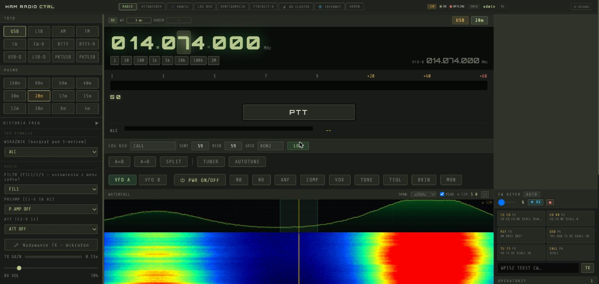
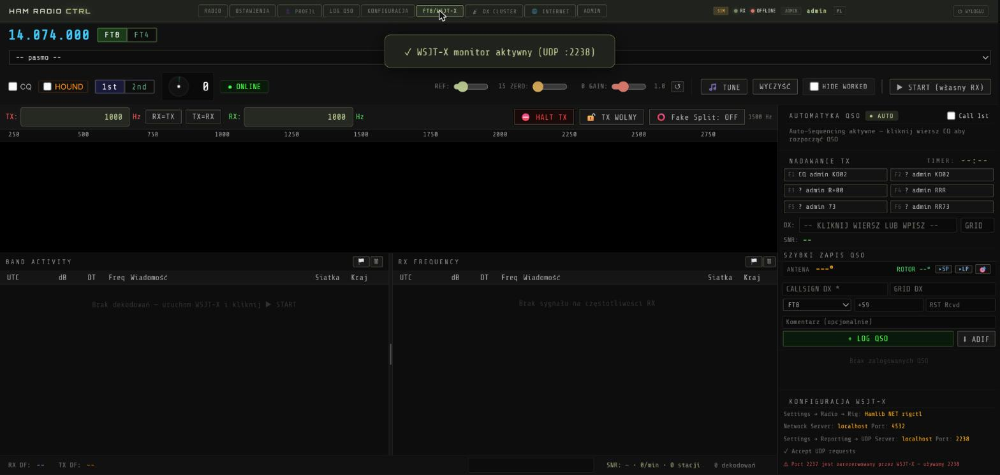
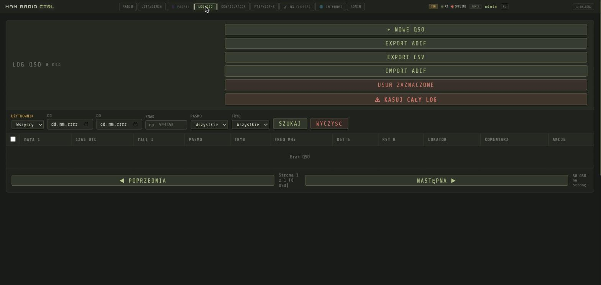

# HAMCTRL

**[English](#english) | [Polski](#polski)**

---

## English

A free, self-hosted web application for remote control of an amateur
radio transceiver — tuning, modes, PTT, rotator, DX cluster, QSO log,
operator chat — **plus a complete, independent FT8/FT4 digital-mode
engine (decoder and encoder) built from scratch, with no dependency on
WSJT-X or JTDX.**

Runs on a Windows PC connected to the radio (reference/tested model:
**Icom IC-7300**) and serves a web UI to any browser on the local network
or, with tunneling configured, over the internet — multiple operators can
share one physical radio, with an ownership/lock system so only one
person transmits at a time.

### Screenshots

| Radio control | FT8/FT4 |
|---|---|
|  |  |

| QSO log |
|---|
|  |

*(Simulation mode — no radio hardware attached; used for these screenshots.)*

### Features

- CI-V radio control: VFO A/B, mode, filters, sliders, band scope + waterfall
- Own FT8/FT4 decoder (Rust, real-time) and encoder (Python) — no WSJT-X/JTDX
- Full auto-QSO engine: Call 1st queue, Fox/Hound DXpedition mode, MSHV multistream support
- CW keyer with a DeepCW audio-to-text assist layer
- Rotator control (Yaesu GS-232A / SPID protocol)
- DX cluster client
- QSO log with CloudLog/WaveLog push, ADIF import/export
- COM-port bridge for third-party CI-V software (CW Skimmer, Ham Radio Deluxe, Logger32)
- Low-latency WebRTC audio for SSB voice
- Multi-user accounts, role-based permissions, shared-radio lock/queue
- Polish / English UI

### Quick start

1. Download the installer from the [latest release](../../releases/latest).
2. Run it, follow [INSTALL.md](INSTALL.md) — first-run setup (admin password, radio connection, CI-V settings on the transceiver) is a few steps, not entirely obvious the first time.
3. Log in, connect your radio, open the RADIO or FT8/WSJT-X tab.

### For developers (and AI coding assistants)

See [ARCHITECTURE.md](ARCHITECTURE.md) for the codebase layout, the
FT8/FT4 pipeline, CI-V driver conventions, and the build/release
pipeline — written specifically so a new contributor (human or AI) can
get oriented without reading every file first.

### License

**AGPL-3.0** — free and open source, and it stays that way: anyone can
use, study, and modify this code, but a modified version *run as a
network service* must also make its source available under the same
license. (The plain GPL only requires this when you *distribute* the
software; AGPL closes that gap for a server application like this one —
which is exactly what this is.) See [LICENSE](LICENSE).

### Credits & thanks

- **The FT8/FT4 protocol** was designed by Joe Taylor, K1JT, and the
  WSJT-X development team, and published openly. HAMCTRL's decoder and
  encoder are an independent implementation from that published
  specification — no WSJT-X/JTDX source code is used anywhere in this
  project.
- **Icom** for the publicly documented CI-V protocol this project
  controls the radio through.
- Built on: [aiohttp](https://github.com/aio-libs/aiohttp),
  [aiortc](https://github.com/aiortc/aiortc) (WebRTC),
  [PyInstaller](https://pyinstaller.org/),
  [Inno Setup](https://jrsoftware.org/isinfo.php),
  and, on the real-time audio side (Rust), `cpal`, `tokio`,
  `rustfft`, `rayon`, and the `opus` codec.
- **Written entirely by AI.** Every line of code in this repository —
  backend, frontend, the Rust audio engine, this documentation — was
  written by Claude (Anthropic), working directly with SQ3MZM, who
  operates the station, tests every change on real hardware, and calls
  the AI "Franek." No other codebase this project's author has worked on
  was built quite like this one.

---

## Polski

Darmowa aplikacja webowa do zdalnego sterowania radiostacją
amatorską — strojenie, tryby pracy, PTT, rotor, DX cluster, log QSO,
czat operatorów — **oraz kompletny, własny tor FT8/FT4 (dekoder i
enkoder) napisany od zera, bez żadnej zależności od WSJT-X czy JTDX.**

Działa na komputerze z Windows podłączonym do radia (referencyjny,
przetestowany model: **Icom IC-7300**) i udostępnia panel WWW dowolnej
przeglądarce w sieci lokalnej, a po skonfigurowaniu tunelu — także przez
internet. Kilku operatorów może dzielić jedno fizyczne radio dzięki
systemowi blokady/przejęcia TRX, tak że nadaje zawsze tylko jedna osoba.

### Zrzuty ekranu

| Sterowanie radiem | FT8/FT4 |
|---|---|
|  |  |

| Log QSO |
|---|
|  |

*(Tryb symulacji — bez podłączonego radia; użyty do tych zrzutów.)*

### Funkcje

- Sterowanie radiem po CI-V: VFO A/B, tryb, filtry, suwaki, scope + wodospad
- Własny dekoder FT8/FT4 (Rust, czas rzeczywisty) i enkoder (Python) — bez WSJT-X/JTDX
- Pełna automatyka QSO: kolejka Call 1st, tryb Fox/Hound (DXpedycje), obsługa multistream MSHV
- Klucz CW z warstwą DeepCW (rozpoznawanie CW na tekst wspomagane audio)
- Sterowanie rotorem (protokół Yaesu GS-232A / SPID)
- Klient DX cluster
- Log QSO z wysyłką do CloudLog/WaveLog, import/eksport ADIF
- Mostek COM dla programów CI-V innych producentów (CW Skimmer, Ham Radio Deluxe, Logger32)
- Audio SSB o niskim opóźnieniu przez WebRTC
- Konta wielu użytkowników, uprawnienia wg roli, blokada/kolejka współdzielonego radia
- Interfejs w języku polskim i angielskim

### Szybki start

1. Pobierz instalator z [najnowszego wydania](../../releases/latest).
2. Uruchom, postępuj wg [INSTALL.md](INSTALL.md) — pierwsze uruchomienie (hasło admina, podłączenie radia, ustawienia CI-V w samym radiu) to kilka kroków, niekoniecznie oczywistych za pierwszym razem.
3. Zaloguj się, podłącz radio, otwórz zakładkę RADIO albo FT8/WSJT-X.

### Dla programistów (i AI wspomagających programowanie)

Zobacz [ARCHITECTURE.md](ARCHITECTURE.md) (po angielsku, zgodnie z
resztą kodu) — układ repozytorium, tor FT8/FT4, konwencje sterownika
CI-V, pipeline buildu i wydania.

### Licencja

**AGPL-3.0** — w pełni otwarty kod, i tak ma zostać: każdy może używać,
czytać i modyfikować ten kod, ale zmodyfikowana wersja **uruchomiona jako
usługa sieciowa** też musi udostępniać swoje źródło na tej samej
licencji. (Zwykła GPL wymaga tego tylko przy dystrybucji software'u —
AGPL domyka tę lukę dla aplikacji serwerowej, a tym właśnie jest
HAMCTRL). Zobacz [LICENSE](LICENSE).

### Podziękowania

- **Protokół FT8/FT4** zaprojektował Joe Taylor, K1JT, wraz z zespołem
  WSJT-X, i opublikował go otwarcie. Dekoder i enkoder w HAMCTRL to
  niezależna implementacja na podstawie tej opublikowanej specyfikacji —
  w tym projekcie nie ma ani linijki kodu z WSJT-X/JTDX.
- **Icom** za publicznie udokumentowany protokół CI-V, przez który ten
  projekt steruje radiem.
- Zbudowane na: [aiohttp](https://github.com/aio-libs/aiohttp),
  [aiortc](https://github.com/aiortc/aiortc) (WebRTC),
  [PyInstaller](https://pyinstaller.org/),
  [Inno Setup](https://jrsoftware.org/isinfo.php),
  a po stronie audio czasu rzeczywistego (Rust) — `cpal`, `tokio`,
  `rustfft`, `rayon` oraz kodek `opus`.
- **Napisane w całości przez AI.** Każda linijka kodu w tym repozytorium —
  backend, frontend, silnik audio w Rust, ta dokumentacja — została
  napisana przez Claude (Anthropic), pracującego bezpośrednio z SQ3MZM,
  który prowadzi stację, testuje każdą zmianę na żywym sprzęcie i nazywa
  AI "Frankiem". Żaden inny projekt, przy którym pracował autor tego
  repozytorium, nie powstał w ten sposób.
